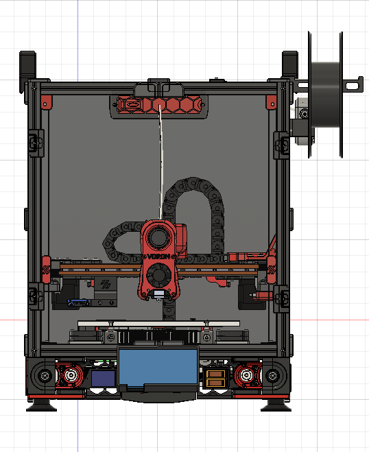
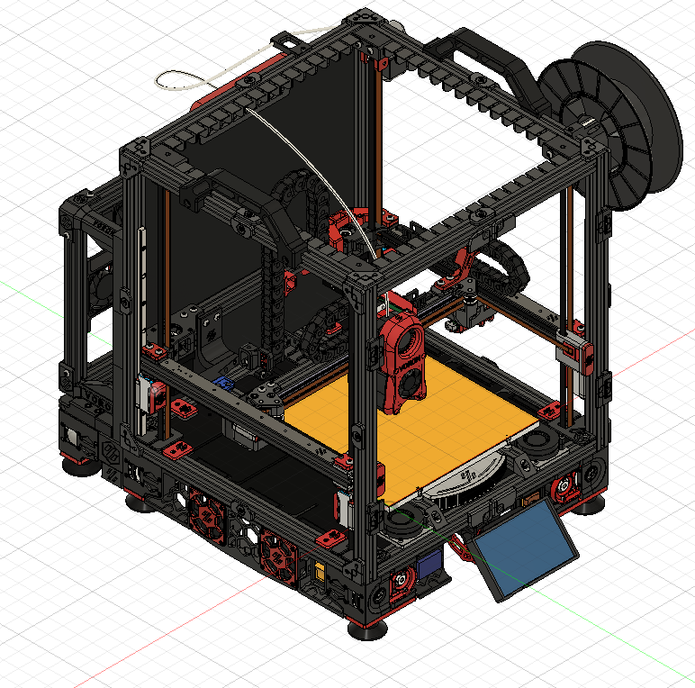
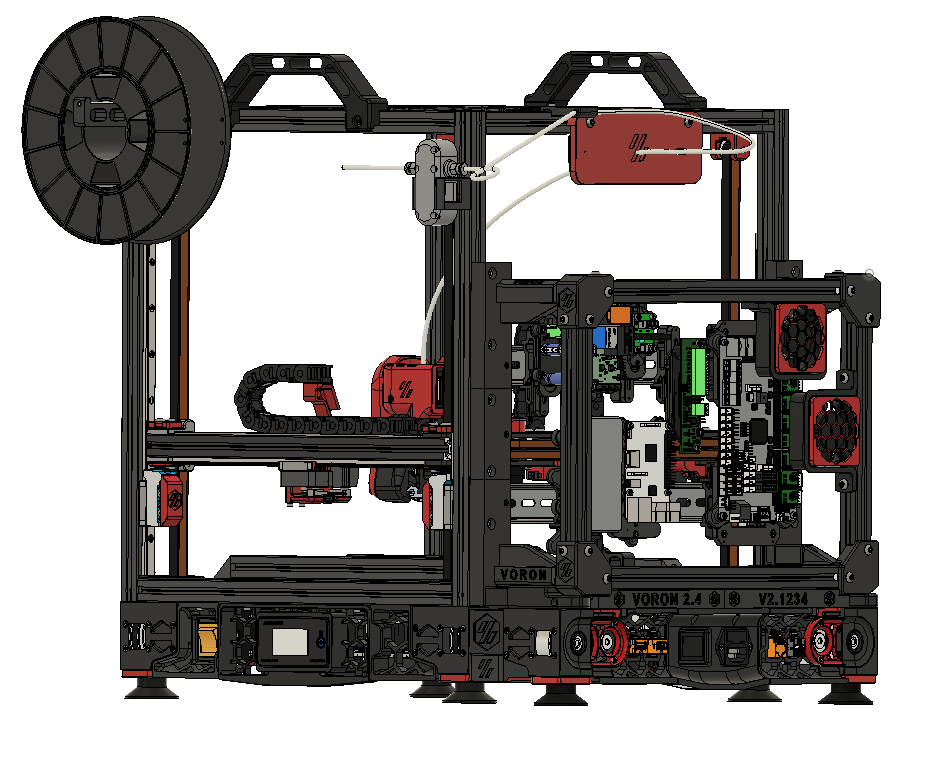
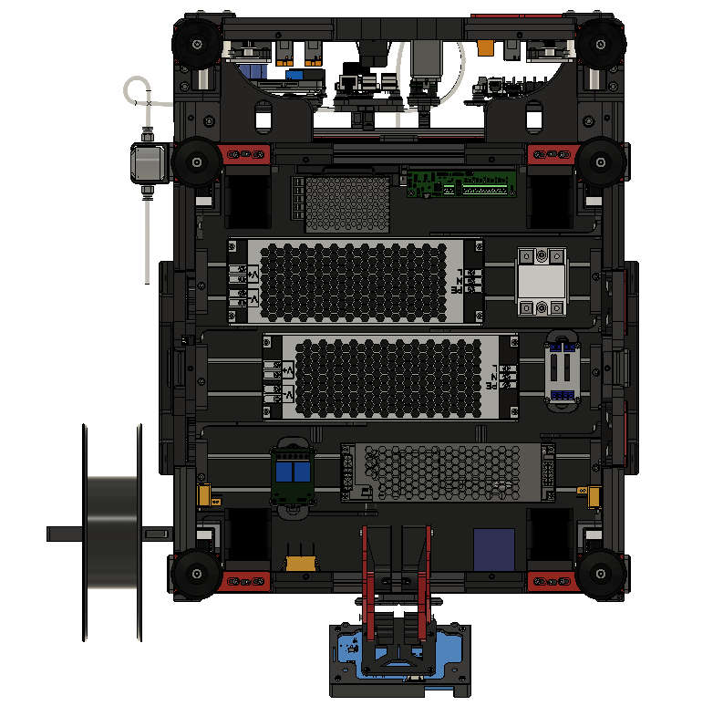
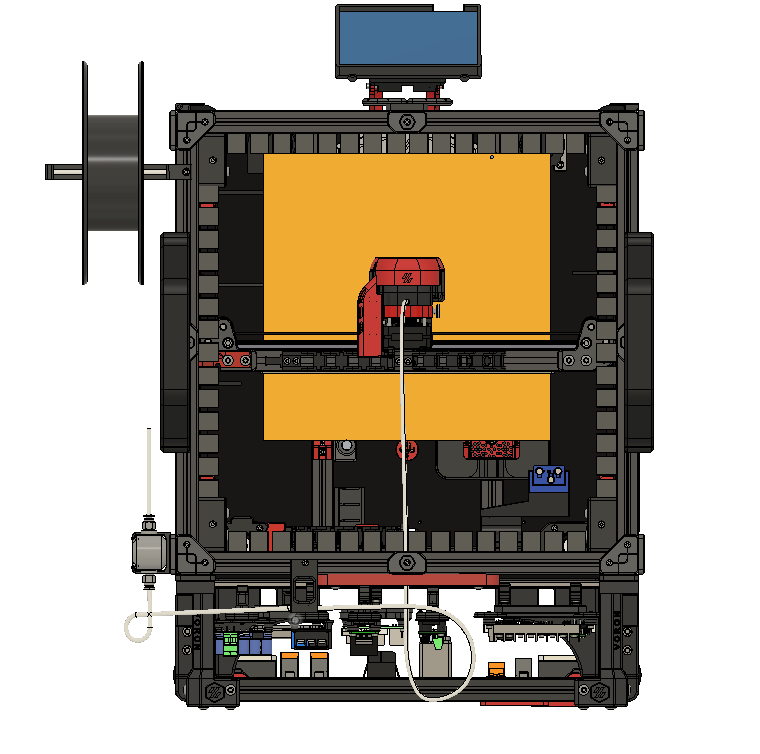

# This repositoy uses LFS extension

```
I use Git for Windows with VScode to manage this repository.  I also use Git LFS extensions for all the files.

Install Git with LFS extensions: https://git-lfs.github.com/

To Download the whole repository do the following: select the "Clone or download button" and
click on "paste to clipboard" button so you can place the URL for the GitHub repository
to the clipboard. Now Open Git Bash.  Change the current working directory to the location
where you want the cloned directory.
Type git clone, and then paste the URL you copied earlier.
$ git clone https://github.com/GadgetAngel/Voron2.4_My_Build_Log.git
Press Enter to create your local clone.
Now open Window explorer to the location of local clone.
```
## This whole repository can be downloaded as one large zip file from my Google drive at:  (if downloading via LFS is giving you are hard time)

## xxxxxxxxxxxxxxxxxxxxxxxxxxxxxxxxxxxxxxxx


### What is the Litter Box Mod?

Think of the "Litter Box" as the poor man's DOOM mod.  Basically, I split the electronics up into two sections. AC electronics go in the "bottom case" on the Voron 2.4 250mm³ and the standard electronics boards go in the "Litter Box" mod.  Instead of putting the "standard electronics" on the TOP of the printer (as the DOOM MOD does),  I put the boards on the BACK of the Voron 2.4 250mm³ build.  I did this so I would **not** have to buy another wiring harness. I can use the wiring harnesses that are pre-made.  For the DOOM Mod the pre-made wiring harness will not work because it will not be long enough, but the "Litter Box" mod allows you to use the pre-made wiring harness.   I also designed the "Litter Box" mod so that one can not tell the "Litter Box" mod is attached to the printer unless you are viewing the Voron from the side.


I also designed the "Litter Box" Mod so that I did not have to cut out a lot of different holes in the Coraplast top/bottom panels or the two Coraplast side panels.  I also designed an "Extended" skirt, so that the back skirt is not hidden underneath the mod, instead the back skirt has been moved out.  This then required me to design an extended Bottom panel to cover the AC socket plugs.  To hold the extedned Bottom panel in place I had to two clips I used the bottom magnetic clips from [Hernsl's "Bottom_panel_mag_clip Mod"](https://github.com/VoronDesign/VoronUsers/tree/master/printer_mods/hernsl/bottom_panel_mag_clip).


Here is a video Tour:

[](https://youtu.be/gklbsIQtgYg)

[


Here are some still photos:


### So how did I start this "Litter Box" Mod?

Since I knew I needed more space I started to search by looking at the CAD models of all the different Voron 3D printer models.  I also knew that I would need to learn Fusion 360, if I wanted to design this mod.

I watched some Youtube videos from [Lars Christensen](https://www.youtube.com/watch?v=DVtzuj7_F9g), and bravely went down this road.  After a couple of days my hands started to hurt so I look into buy a [space mouse](https://3dconnexion.com/uk/product/spacemouse-wireless/).  A space mouse allows you to turn the Fusion 360 model like you are holding the part in your own hands.

Before I bought the space mouse, I converted by free license for Fusion 360 into a subscription license.  After doing this I uploaded all the Voron printer models and start to look around.

On the Voron 1.8 there is a back pack electronic case that holds the DC electronics.  I decide to start with this item and develop my "Litter Box" Mod from it.

On the Voron 1.8 the back pack electronic case is inside the frame of the printer.  Mine litter box will be on the outside of the frame.  On the Voron 1.8 back pack electronics do not have compressor feet because the feet is actually the extrusion with a 3D printed part.

So I decide to replace the Voron 1.8 back pack electronic case feet with mirror images of the upper support brakets.

To attach the DIN rails to the back of the machine I found the [hijax_pl's din_rail_mount - the angled DIN mount version](https://github.com/VoronDesign/VoronUsers/tree/master/printer_mods/hijax_pl/din_rail_mount).  After doing the first through 4th revisions of the Litter Box Mod, I finally decided to check out the DIN mounts from the Trident model.  After I saw how the Trident version of DIN mounting looked I started to use and design items that would utilize the Trident DIN mounting system.

So my brackets that hold the DIN rail to the back of the Voron printer first use [hijax_pl's angled DIN mount](https://github.com/VoronDesign/VoronUsers/blob/master/printer_mods/hijax_pl/din_rail_mount/din_rail_mount_angle_panel.step). But when I looked at the outline for how the DIN rail fit into his part, I noticed that if your printer is not well turned this part may cause issues due to the low clearence in the hole for the outline of the DIN rail.  While looking at the Trident 3D printed parts, the DIN mount from Trident has a larger clearnece for the DIN rail but utilizes a M3 screw to hold the DIN rail down with frictions.So I changed out my design to use the Trident version of the DIN rail but merging the two mounts together into.  The Angled part of the mount from hijax_pl got added to the Trident DIN mount.

Since I did not want to drill a lot of holes in my Coraplast panels for the top/bottom and the two side panels of the Litter Box, I decided not to make a curvy version of the DIN mount.  I keeped it in a block shape. That way when all the support brackets are installed the brackets have the same height.  The panel for the sides are the same.  The Top is the same as the bottom except the bottom panel has an oval slot shape cut out so that you can pass wires from the bottom elctronics case up to the Litter box on the back of the printer.

I first tackled the Corner Support brackets.  I knew I wanted to design for different Back Panel thickness.  My mod has three versions (3mm, 4mm and 6mm).

The Corner Support Brackets from the Voron 1.8 attach to a Vertical extursion from the inside side of the frame.  The litter box has to hang off the back so I do not have access to the inside of the extrusion unless I cut holes in the Voron 2.4 Back panel.

I decide that I did not want to cut holes in the Voron 2.4 Back Panel.  So I added to the DIN mounting bracket.  The 4 Corner Support Brackets are integrated into the DIN Mounting Brackets.  I designed to use three (3) M2x20 Socket Head Screws (which have counterbore holes for the M2 screw head) and I designed to use M2 heat set inserts to secure the DIN mount bracket to the Corner Support Bracket.

The M2 heat set insert will be placed inside the 4 Coroner Support Brackets. The M2 heat set insets you will need to buy can be purchased from [AliExpress](https://www.aliexpress.com/item/4000232858343.html?spm=a2g0s.9042311.0.0.dcd44c4dya58ZN) - the recommended vendor from the Voron 2.4 sourcing guide. Buy the buy the  "M2 X D4.0 X L5.0" version of the M2 heat set inserts. I suppose you can use any M2 heat set insert as long as it is not wider than 4mm and longer the 5mm.

The M2x20 Socket Head Screws can be purchased anywhere. I bought from [McMaster-Carr](https://www.mcmaster.com/catalog/127/3366) but you can easily use ones from [Amazon](https://www.amazon.com/gp/product/B07H4MG7TC).

I could not use M3 screw because the holes were too big for the design I started off with.  I first created a DIN bracket that had a slot built into the bracket to allow the Coraplas panel to slide into the slot. But after examining the bracket design, I opted to remove the slot to make the DIN bracket stronger.  It is more important to that the DIN mounts are solid and can hold the electronics board, PSU and DIN rail to the back panel.

But since I started out with a slotted DIN mount, I designed using M2 screws because the M3 screws would not fit.  I suppose if someone wanted to mod my mod you could create an M3 version but M2x20 screws are not hard to come by.

The next issue in my design arose when I noticed that the Side Panel woud stick out on either side of the extrusion. So when you looked from the front of the printer you would ask yourself, "what is that black plastic in the middle of the back of the printer?".  I decided to offset the Corner Support brackets so that the Litter Box could not be seen from the front of the Voron 2.4.

The next issue to arise was the back skirt.  It was sitting below the litter box but under the litter box.  I wanted the back skirt to be fush with the back panel of the litter box.  So the problem was how to extend the skirt?  I remebered that I read some talk about the Voron 2.4 300mm³ printer's sit heavily on the back two feet of the printer.  So my next concern was would the printer tilt over with the Litter Box on the back?  To solve the exteded skirt and the possibility of tilting I decided to create two dummy Z drive/feet combos (basically creating two new feet).  These dummy Z drive feet look like the real Z drives but they are just made out of 3D printed plastic.  This way you can match the feet up if you want.  Since I am using the [Edwardyeeks' "V2.4_z_drive_motor_tensioner_mod"](https://github.com/VoronDesign/VoronUsers/tree/master/printer_mods/edwardyeeks/V2.4_z_drive_motor_tensioner_mod) and [Spaghetti-Bolognese's "Z Driver System Mods"](https://github.com/VoronDesign/VoronUsers/tree/master/printer_mods/Spaghetti-Bolognese/Z_drive_motor_mount) combo on my printer, I choose to just stick with the Voron 2.4 original Z drive feet.  This way if you choose not to do the Z driver mods the feet will all match. By adding two feet and using the Z Drive block at a way to stretch the skirt the "side extended skirt" is created.

So now I needed to design a way to mount the back skirt (the same one you would normally use) to the bottom of the Litter Box.  Since the Litter Box uses only 2020 extrusions that was really not a problem.

The Litter Box uses the following 2020 extrusions lengths:

Take the Frame Width for you build size (for me 250mm³ my frame width is 410mm) and subtract 56mm to obtain the Top and Bottom extrusion length need for the Litter Box. To find the length of the Side 2020 extrusions take you frame width and subtract 182mm.
So for my 250mm³ build I will need the following 2020 extrusions:

1. Top/Bottom 2020 Extrusion (frame width - 56mm) Length = 354mm

2. Two Side 2020 Extrusions (rame width - 182mm) Lenght = 228mm

The Coraplast panels are 4mm thick (or what ever material you want to use, I plan on carbon fiber panels after I test out the Coraplast panels) dimensions can be calculated as follows:

The height of the Top/Bottom Panels, the height of the Right/Left Side Panels, the height of the Front Panel and the width of the Right/Left Side Panels will stay the same for all build sizes. The only dimension that will change is the distance between your two back vertical extrusions which will only effect the Top/Bottom width and the Front Panel width:

Top/Bottom Coraplast panels' dimensions for the Litter Box Mod:

Height = 93mm
Width = (frame width - 53.5)

Left/Right Side Coraplast Panels' dimensions for the Litter Box Mod:

Height = 242 mm
Width = 75.5 mm

Front Coraplast Panel's dimensions for Litter Box Mod:

Height = 242 mm
Width = (frame width - 55.5)

There are cut outs that need to be made for the front panel, I need to do the drawing for this panel. I will publish it here when I get it done. I will do it in .dxf format and .pdf format. I will even create a .svg file for it.

So for **my 250mm³ QUEEN Build** I will use the following dimensions for my Coraplast panels:

Top/Bottom Coraplast Panels dimenstions for the Litter Box Mod on a 250mm³ Voron 2.4 Build:

Height = 93mm
Width = (frame width {410} - 53.5) = 356.5mm

Left/Right Side Coraplast Panels' dimensions for the Litter Box Mod  on a 250mm³ Voron 2.4 Build:

Height = 242 mm
Width = 75.5 mm

Front Coraplast Panel's dimensions for Litter Box Mod  on a 250mm³ Voron 2.4 Build:

Height = 242 mm
Width = (frame width {410} - 55.5) = 354.5

(BTW, you will notice that the width of the Front panel is only 2mm shorter than the so Front Panel width = (Top/Bottom Width - 2mm))!

Back to what I was talking about, how to did I mount the back skirt to the litter box mod.  I wanted the height of the back skirt to be exactly as it is on the original Voron 2.4 printer.  So I decided to create an "Interface Bar".  The Height of this interface bar will change depending on how high you mount the Litter Box to the two back vertical extrusions.  I choose to place the Litter Box as low as I could go on the back two vertical 2020 extrusions.

So my mod fixes the Litter Box to be mounted at the bottom of the two back 2020 extrusions and my 3D model has it placed at that
location.

Since I decided on my mount location, I design the inteface bar (which is a 3D printed part). In the 3D model you see the word's VORON 2.4    V2.1234, I use the Interface Bar as a way to register your Voron serial number when you get one.  So this parts lettering will be printed with "VORON 2.4" and "V2.1234". You can reprint this part and remount it after you get your serial number.

The Interface Bar is just a block of plastic with a slotted hole, that allows the screw to pass through to the Litter Box Bottom 2020 extrusion.  You will need to use longer M3 screw to mount your back skirt pieces but you will not have to reprint your back skirt peices.  You just need to print the Interface Bar A/B and the Foot Interface A/B piece.  

What is the Foot Interface A/B piece.  The Foot Interface is how the two dummy feet get mounted to the Bottom 2020 extrusion of the Voron 2.4 printer.  The Foot Interface A/B comes in three sizes to accomdate three different Voron 2.4 Back Panel thickness sizes (3mm, 4mm, and 6mm).


<!--- You can download the JPG file for this "Wiring Harness" by clicking on the filename ["Voron_2.4_Tool_Head_PCB__Wiring_Harness.jpg"](https://github.com/GadgetAngel/Voron2.4_My_Build_Log/blob/main/Voron2.4_My_Build_Log/Wiring_Harness_Diagram/Voron_2.4_Tool_Head_PCB__Wiring_Harness.jpg) or the filename ["Voron_2.4_Tool_Head_PCB__Wiring_Harness_400ppi.jpg"](https://github.com/GadgetAngel/Voron2.4_My_Build_Log/blob/main/Voron2.4_My_Build_Log/Wiring_Harness_Diagram/Voron_2.4_Tool_Head_PCB__Wiring_Harness_400ppi.jpg) and then hit the download button.

Again, to download the PDF just click on the filename ["Voron_2.4_Tool_Head_PCB__Wiring_Harness.pdf"](https://github.com/GadgetAngel/Voron2.4_My_Build_Log/blob/main/Voron2.4_My_Build_Log/Wiring_Harness_Diagram/Voron_2.4_Tool_Head_PCB__Wiring_Harness.pdf) or the filename ["Voron_2.4_Tool_Head_PCB__Wiring_Harness_400ppi.pdf"](https://github.com/GadgetAngel/Voron2.4_My_Build_Log/blob/main/Voron2.4_My_Build_Log/Wiring_Harness_Diagram/Voron_2.4_Tool_Head_PCB__Wiring_Harness_400ppi.pdf) and hit the download button.

  -->

## A Picture of the "Litter Box" mod for QUEEN:

The "Litter Box" mod is a place to store all you good shit......LOL

The name is a wink to RCF (a.k.a RussianCatFood).

I also have posted two videos which give you a roatating view of the QUEEN 3D model.  This is the 3D model I used
to devleop the Litter Box.

1. First look Video: https://youtu.be/x5X1lYImGgg;

2. Second Look Video: https://youtu.be/KOevvhMHMqQ

Here are some still pictures:

The Front View:



 The Litter Box can not be seen, the Voron 2.4 looks actually like a regular Voron 2.4 machine.

The Left Profile View:



This is where you see the Litter Box mod.  The Litter Box mod will hang off the back and over the Back Panel of the Voron 2.4 printer. There is no need to buy another Back Panel since the Litter Box Mod is designed to hold the Back Panel in place instead of the Panel Clips.

The Wide Right View:



The Bottom View with panels:



The Bottom View without panels:


The View from the TOP:




 ## A Picture of the "Litter Box" "Electronics Case Wiring Diagram" for QUEEN:

Coming Soon.

I intend to use snapshots from the 3D model I developed for the QUEEN printer, showing you the acutal route I
will use for each wire.

<!--- You can download the JPG file for this "Wiring Harness" by clicking on the filename ["Voron_2.4_Tool_Head_PCB__Wiring_Harness.jpg"](https://github.com/GadgetAngel/Voron2.4_My_Build_Log/blob/main/Voron2.4_My_Build_Log/Wiring_Harness_Diagram/Voron_2.4_Tool_Head_PCB__Wiring_Harness.jpg) or the filename ["Voron_2.4_Tool_Head_PCB__Wiring_Harness_400ppi.jpg"](https://github.com/GadgetAngel/Voron2.4_My_Build_Log/blob/main/Voron2.4_My_Build_Log/Wiring_Harness_Diagram/Voron_2.4_Tool_Head_PCB__Wiring_Harness_400ppi.jpg) and then hit the download button.

Again, to download the PDF just click on the filename ["Voron_2.4_Tool_Head_PCB__Wiring_Harness.pdf"](https://github.com/GadgetAngel/Voron2.4_My_Build_Log/blob/main/Voron2.4_My_Build_Log/Wiring_Harness_Diagram/Voron_2.4_Tool_Head_PCB__Wiring_Harness.pdf) or the filename ["Voron_2.4_Tool_Head_PCB__Wiring_Harness_400ppi.pdf"](https://github.com/GadgetAngel/Voron2.4_My_Build_Log/blob/main/Voron2.4_My_Build_Log/Wiring_Harness_Diagram/Voron_2.4_Tool_Head_PCB__Wiring_Harness_400ppi.pdf) and hit the download button.

  -->

  ### The PDF file of the "Litter Box" "Electronics Case Wiring Diagram" for QUEEN:

Coming Soon.

I intend to use snapshots from the 3D model I developed for the QUEEN printer, showing you the acutal route I
will use for each wire.

<!--- The PDF file looks the same as the JPG file. You can enlarge the image for both file types to get all the details.

You can view the PDF in your browser by clicking on the filename ["Voron_2.4_Tool_Head_PCB__Wiring_Harness.pdf"](https://github.com/GadgetAngel/Voron2.4_My_Build_Log/blob/main/Voron2.4_My_Build_Log/Wiring_Harness_Diagram/Voron_2.4_Tool_Head_PCB__Wiring_Harness.pdf) and then hit the download button.

You can view an even higher resolution image when you view the PDF in your browser by clicking on the filename ["Voron_2.4_Tool_Head_PCB__Wiring_Harness_400ppi.pdf"](https://github.com/GadgetAngel/Voron2.4_My_Build_Log/blob/main/Voron2.4_My_Build_Log/Wiring_Harness_Diagram/Voron_2.4_Tool_Head_PCB__Wiring_Harness_400ppi.pdf) and then hit the download button. -->