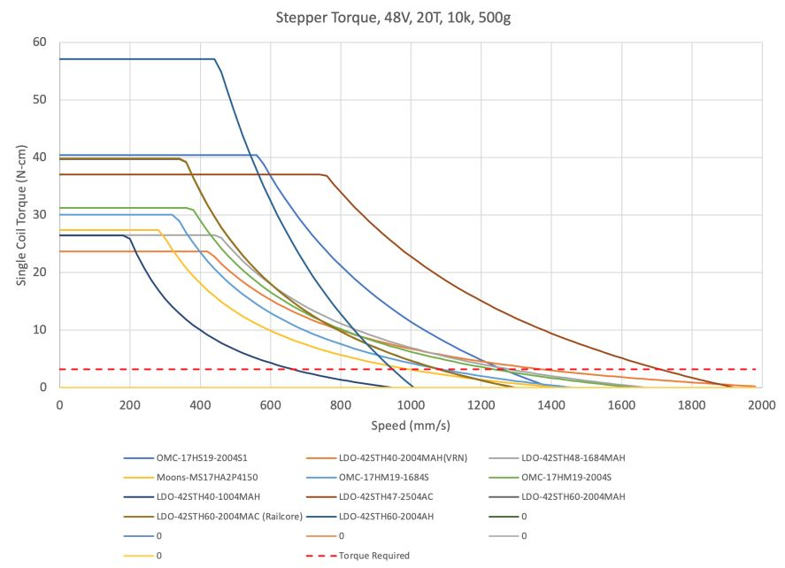
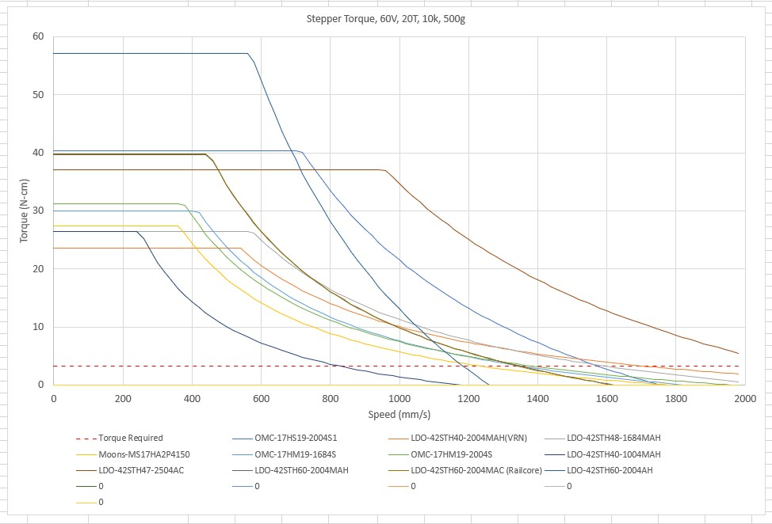

## This is a Build Log for my Voron 2.4 250 mm DIY 3D Printer called "QUEEN":

My Voron 2.4 3D Printer has a name "QUEEN".

This repository contains wiring diagrams, specification sheets, any documentation I use to complete my Voron 2.4 build. I also am including aesthetic designs for QUEEN's back panel and side panels.

# This repositoy uses LFS extension

```
I use Git for Windows with VScode to manage this repository.  I also use Git LFS extensions for all the files.

Install Git with LFS extensions: https://git-lfs.github.com/

To Download the whole repository do the following: select the "Clone or download button" and
click on "paste to clipboard" button so you can place the URL for the GitHub repository
to the clipboard. Now Open Git Bash.  Change the current working directory to the location
where you want the cloned directory.
Type git clone, and then paste the URL you copied earlier.
$ git clone https://github.com/GadgetAngel/Voron2.4_My_Build_Log.git
Press Enter to create your local clone.
Now open Window explorer to the location of local clone.
```

## This whole repository can be downloaded as one large zip file from my Google drive at: (if downloading via LFS is giving you are hard time)

## xxxxxxxxxxxxxxxxxxxxxxxxxxxxxxxxxxxxxxxxxxxxx

## Mother board I plan on using:

I will be using the Octopus Pro V1.0 board as the mother board for my Voron 2.4 printer.
I will be powering my TMC5160 PRO stepper motor drivers with 48V DC.

## Planning Phase:

I am ~~still planning~~ done planning my Voron 2.4 build.

I have all my PIF parts and sourced all my parts via "sub-kits".  This will be explained later.

I wanted to post an Excel spreadsheet for sourcing all my "sub-kits" or individual items for my Voron 2.4, but I need to remove it from a bigger spreadsheet I have been using to keep track of a lot of different information.  After I get done with the electronics case wiring diagram, I will work on providing an Excel spreadsheet as a sourcing guide for my Voron 2.4.

## MODS I plan for QUEEN:

For now these are the MODS I am going to use in my build:

GadgetAngel's Voron 2.4 MODS (250 mm³ Build):

Tool head PCB board options (MODS) I am using:

1. Hartk1213's "Voron Afterburner Toolhead Board v3.rabbit" (https://github.com/hartk1213/Voron-Hardware/tree/hartk1213/Voron-Hardware/Afterburner_Toolhead_PCB). Buy one at https://deepfriedhero.in/products/voron-afterburner-toolhead-board-v3-rabbit?_pos=1&_psq=v3.&_ss=e&_v=1.0

Wiring Diagram for Voron Afterburner Toolhead Board v3.rabbit" Tool headboard: https://github.com/hartk1213/Voron-Hardware/blob/hartk1213/Voron-Hardware/Afterburner_Toolhead_PCB/Images/Wiring/ERCF-Toolhead%20SKR%201_4%20wiring.png


Also see my [wiring harness diagram!](https://github.com/GadgetAngel/Voron2.4_My_Build_Log/tree/main/Wiring_Harness_Diagram)

---

Other MODS I am using for my QUEEN build (Z belts 9mm; XY belts 6mm):

1. [Arkeet's "MGN12 Mod"](https://github.com/VoronDesign/VoronUsers/tree/master/printer_mods/arkeet/mgn12);

2. [Hartk1213's "PINS Mod"](https://github.com/hartk1213/MISC/tree/main/Voron%20Mods/Voron%202/2.4/Voron2.4_Pins_Mod);

3. [Ramalama2's "Misumi_RBPB5 Mod"](https://github.com/Ramalama2/Voron-2-Mods/tree/main/Misumi_RBPB5);
Note: this replaces the GE5C Mod;

4. [0ndsk4's "NeverMore Micro Filter Mod"](https://github.com/0ndsk4/VoronUsers/tree/0ndsk4/printer_mods/0ndsk4/Nevermore_Air_Filter/Nevermore_Micro);

5.  I combined two mods into one, "Z Drive Motor Tensioner Mod" was combined from the following sources:

    * Z Motor A/B Unit combined from [Edwardyeeks' "V2.4_z_drive_motor_tensioner_mod"](https://github.com/VoronDesign/VoronUsers/tree/master/printer_mods/edwardyeeks/V2.4_z_drive_motor_tensioner_mod); with my modification for the front Skirts for switches and Hour counter;

    * Z Motor A/B  Motor Unit combined from [Spaghetti-Bolognese's "Z Driver System Mods"](https://github.com/VoronDesign/VoronUsers/tree/master/printer_mods/Spaghetti-Bolognese/Z_drive_motor_mount);

6. [Jlas1's "Klicky Probe Mod"](https://github.com/jlas1/Klicky-Probe) and information about the Klicky Probe mod from  [Ramalama2's "KlickyShare GitHub repo"](https://github.com/Ramalama2/Voron-2-Mods/tree/main/KlickyShare);  I also used the following "user mods" for the "Klicky Probe Mod":

    * [StefanRaatz's "Klicky Probe with additional holes mod"](https://github.com/jlas1/Klicky-Probe/tree/main/Usermods/StefanRaatz);

    * [bluedragonx's "BlueDragonX's Klicky Mods"](https://github.com/jlas1/Klicky-Probe/tree/main/Usermods/bluedragonx);

    * [Oc_geek's "More Robust Klicky Probe mod"](https://github.com/jlas1/Klicky-Probe/tree/main/Usermods/oc_geek);

    * I combined StefanRaatz's "Klicky Probe with additional holes mod" and Oc_geek's "More Robust Klicky Probe mod" for my version of "More Robust Klicky Probe mod".

7. [Whoppingpochard's "Ti Backers Mod"](https://github.com/tanaes/whopping_Voron_mods/tree/main/extrusion_backers); Y backers 30mm from front; X backer 35mm from the Y axis drag chain;

8. [Ramalama2's "Front_Idlers mod" ](https://github.com/Ramalama2/Voron-2-Mods/tree/main/Front_Idlers); - these are replacement for Phalanx's "Other-V2-Idlers mod;

    * [Phalanx's "Other-V2-Idlers mod"](https://github.com/VoronDesign/VoronUsers/tree/a425971f2986578e2e5c10e638f59d02172687c1/printer_mods/Phalanx/Other-V2-Idlers);


9. [Badnoob's "AB-BN30 Afterburner mod"](https://github.com/VoronDesign/VoronUsers/blob/master/printer_mods/Badnoob/AB-BN/Readme.md);

10.	[Hartk1213's "Sexbolt Z-Endstop Mod"](https://github.com/hartk1213/MISC/tree/main/Voron%20Mods/Voron%202/2.4/Voron2.4_SexBolt_ZEndstop);

11.	Cover for Toolhead, I created my own (in this repository) - from [Hartk1213's "ERCF covers"](https://github.com/VoronDesign/Voron-Hardware/tree/master/Afterburner_Toolhead_PCB/STLs/Clockwork/Covers); I placed vents on the ERCF cover for ABBN30.

12.	[Whoppingpochard's "Z_Drive_Belt_Exit_Covers Mod"](https://github.com/tanaes/whopping_Voron_mods/tree/main/Z_belt_cable_cover);

13.	[Edwardyeeks' "Decontaminator_Purge_Bucket_&_Nozzle_Scrubber Mod"](https://github.com/VoronDesign/VoronUsers/tree/master/printer_mods/edwardyeeks/Decontaminator_Purge_Bucket_%26_Nozzle_Scrubber);

14.	[Hernsl's "Bottom_panel_mag_clip Mod"](https://github.com/VoronDesign/VoronUsers/tree/master/printer_mods/hernsl/bottom_panel_mag_clip);

15.	[Wile-e1's "Deck_Panel_Support_Clips Mod"](https://github.com/VoronDesign/VoronUsers/tree/master/printer_mods/wile-e1/Deck_Panel_Support_Clip);

16.	[Tayto-chip's "Skirt_switch_mod"](https://github.com/VoronDesign/VoronUsers/tree/master/printer_mods/tayto-chip/skirt_switch_mod) - with my modifications;

17.	[Leandromarceddu's "PowerSkirt Mod"](https://github.com/VoronDesign/VoronUsers/tree/master/printer_mods/leandromarceddu/PowerSkirt) - with my Modifications;

18.	[StvPtrsn's "Side_Fan_Support_No_Tape Mod"](https://github.com/VoronDesign/VoronUsers/tree/master/printer_mods/StvPtrsn/Side_Fan_Support_No_Tape);

19.	[MarcPot's "Skirt_Mod_250 Mod"](https://github.com/VoronDesign/VoronUsers/tree/master/printer_mods/MarcPot/Skirt_Mods/250); - with my modification so that you can use this with the magnatic bottom panel;

20. My BTT-PITFT5-Mount Mod come from the following sources:

    * [Alanho's "BTT_PITFT50_v2_Mount Mod"](https://github.com/VoronDesign/VoronUsers/tree/master/printer_mods/alanho/BTT_PITFT50_v2_Mount);

    * [Smaseface's "BTT-PITFT5-Mount mod"](https://github.com/smaseface/BTT-PITFT5-Mount-for-Voron-v2.4);

    * [Revnull's "Articulating arm" from his "rpi_7in_display_mount mod"](https://github.com/VoronDesign/VoronUsers/tree/master/printer_mods/revnull/rpi_7in_display_mount);

    * [driftology's "Fysetc Paneldue 7i V3 Voron 2 Adapter on Thingiverse.com"](https://www.thingiverse.com/thing:4571677);

21.	[Randell's "Microswitch_Endstop POD"](https://github.com/VoronDesign/VoronUsers/tree/master/printer_mods/randell/Microswitch_Endstop);

22. [Ramalama2's "Misumi_Cable_Clip mod"](https://github.com/Ramalama2/Voron-2-Mods/tree/main/Misumi_Cable_Clip);

23. [Ramalama2's "AB_Plug_Microfit mod"](https://github.com/Ramalama2/Voron-2-Mods/tree/main/AB_Plug_Microfit); or [AB_Plug_JST-XHmod](https://github.com/Ramalama2/Voron-2-Mods/tree/main/AB_Plug_JST-XH);

24. [Ramalama2's "Panel_Clips"](https://github.com/Ramalama2/Voron-2-Mods/tree/main/Panel_Clips); - (use 6mm version when you print out the clips!!! - 3mm panel and 3mm of foam tape);

25. [Richardjm's "ADXL345 Mount Mod"](https://github.com/richardjm/VoronUsers/tree/richardjm/adxl-chain/printer_mods/richardjm/adxl-chain); I used information from [Padok's ADXL345 Mount](https://github.com/VoronDesign/VoronUsers/tree/master/printer_mods/padok/chain_anchor-ADXL345_mount);

26. [Eddie's "LED_Bar_Clip mod"](https://github.com/VoronDesign/VoronUsers/tree/master/printer_mods/eddie/LED_Bar_Clip);

27. [Hartk1213's  "AB Spinner (Voron2.4_Spinner) mod"](https://github.com/hartk1213/MISC/tree/main/Voron%20Mods/Voron%202/2.4/Voron2.4_Spinner); or [Rubber Ducky Spinner Mod](https://discord.com/channels/460117602945990666/828406858271162378/875463215721644032)

28. [42bios' "corner_panel_clip_cable mod"](https://github.com/VoronDesign/VoronUsers/tree/master/printer_mods/42bios/corner_panel_clip_cable);

29. [OV1A's "WAGO+221+DIN+rail+holder mod" from Thiniverse.com](https://www.thingiverse.com/thing:4972435);

30. [The0bone's "Voron 2.4 China Chain Guide mod" on Prusaprinters.org](https://www.prusaprinters.org/prints/69683-voron-24-china-chain-guide?fbclid=IwAR1xfiLFqM1xiLLYC27wswsilp6afWQkuD313DK3K7LC2ITIk452Heg-T0U);

31. For handling the thermal expansion on the Build Plate for QUEEN, I added the Mandala Rose Works's ["Matched Height Kinematic Kit"](https://www.mandalaroseworks.com/shop/voron/matched-height-kinematic-kit) along with ["Voron 250 Standard Bed"](https://www.mandalaroseworks.com/shop/voron/voron-250-standard-bed),

    The following will be need if you add the kinematic kit to your Voron 2.4 Build:
    *  [Shorten the purge bucket](https://discord.com/channels/460117602945990666/635687829254701107/905929693587464242);
    *  [buy a longer sexbolt for #J mod](https://www.amazon.com/gp/product/B07GSQZWNP) and
    *  buy some [Openbuild's Angled brackets](https://deepfriedhero.in/products/openbuilds-angle-corner-connector?_pos=2&_sid=c4c7e2ca4&_ss=r) or you could just use blind joints;

32. [GadgetAngel's "Litter Box mod"] (https://github.com/GadgetAngel/Voron2.4_My_Build_Log/tree/main/Electronics_Case_Wiring_Diagram);

33. I also used all Trident DIN clips for mounting electronics and I used Trident 3D Printed Parts on the MGN12 Mod. **Thank you Voron Design Team for all your hard work!**

## How I Calculated the Power Requirements for my Voron 2.4 Build:

I know a lot of you already know the answer but for the rest of us that are still learning about bipolar stepper motors and stepper drivers I will describe the process I used.  I never realized that the motors I own are **bipolar-series motors**.

To me when things are connected in series the wires are daisy-chained together (positive lead1, negative lead1 is connected to positive lead2, negative lead2).

When things are wired in parallel then the positive leads are connected together and the negative leads are connected together.

So I thought the 3D printer motors where connected together in parallel on the 3D printer, which they are. If you look at the **system in a "macro" view** not a "micro" view.

My problem was not understanding the term "series" and "parallel" when it applies to the internal wiring of the 4-wire bipolar motor (a "micro" view).

I had to look at an 8-wire bipolar motor before I actually got it through my thick head.

Maybe this will help others:

[Drawing of 8 wire bipolar-parallel motor](https://www.google.com/search?rlz=1C1KDEC_enUS925US925&sxsrf=AOaemvLwrmaDl8ua4lQseCKg1z3Zyqv7hA:1632969577225&source=univ&tbm=isch&q=stepper+driver+schematic+with+bipolar+parallel&fir=4TCFBxk3bBwQHM%252CPz8Y0vCOJhjweM%252C_%253Bdc6Xcx5op01amM%252CPz8Y0vCOJhjweM%252C_%253BItQbyHd9IexujM%252CdmTk8dQZiaTOKM%252C_%253BJq7NH4XUzw-gaM%252CbmpTPUvcAgJ1iM%252C_%253BNUciJ8biUMyATM%252CdmTk8dQZiaTOKM%252C_%253Bek59VPLAp7FTaM%252CfLr7UhIdS3zfiM%252C_%253Bcr7a5jpp9XtmSM%252CzzUhUZJ6gFb9SM%252C_%253BcHqWrnFkQqbUFM%252CU6NS1Lt6QBz7EM%252C_%253BxAUcqizP6jkfWM%252C8vsQdXCGrpQ9nM%252C_%253BHgNwYdr3N6uCPM%252CNKxfcF59LDIYkM%252C_&usg=AI4_-kR9_lmMfvjdB0rNsNvfnE_PhDKY6w&sa=X&ved=2ahUKEwi28NDc1aXzAhXFmmoFHevzDAUQ7Al6BAgCEEY&biw=1514&bih=650&dpr=1.25#imgrc=HgNwYdr3N6uCPM)

[Drawing of 8 wire bipolar-series motor](https://www.google.com/imgres?imgurl=https%3A%2F%2Fbuildbotics.com%2Fcontent%2Fimages%2F2019%2F09%2F8wireSeries.png&imgrefurl=https%3A%2F%2Fbuildbotics.com%2Fwiring-stepper-motors%2F&tbnid=c1vZXhJLkcsohM&vet=12ahUKEwinr7uN1aXzAhUGFKwKHYYtChEQMygJegUIARCzAg..i&docid=NKxfcF59LDIYkM&w=716&h=395&q=stepper%20driver%20schematic%20with%20bipolar%20motor%20series&ved=2ahUKEwinr7uN1aXzAhUGFKwKHYYtChEQMygJegUIARCzAg)

So ALL my motors are 4-wire bipolar-series motors!

 To Determine the amount of Power Required for your Voron 2.4 build:

 Fact: During a Z Hope move 6 motors will be active at a time.

 Fact:  Extruder (E) Motor LDO-42STH20-1004ASH:
		Rated Peak current: 1.0A/ Phase

 Fact:  Z motors and AB motors are LD0-42STH40-2004MAH
		Rated Peak current: 2.0A / Phase

 Rule of Thumb (https://robotics.stackexchange.com/questions/14071/how-to-calculate-my-power-supply-voltage-and-current):

 1. Power_supply_current = number_of_motors * 1/3 * motor_peak_current for "bipolar-series motors" (All LDO motors are bipolar-Series Motors!)

 2. Power_supply_current = number_of_motors * 2/3 * motor_peak_current for "bipolar-parallel motors"

 Since ALL LDO motors I own are bipolar-Series Motors we will use Rule of Thumb #1 ONLY!

 Power_ supply_current = (5 * 1/3 * 2.0 Amps) + (1 * 1/3 * 1.0A) = 3.333 + 0.333 = 3.6667 or 4 Amps.

 So for **my bipolar-series motors** I want to know many Watts of power is 4 Amps at 48 VDC?

 Answer: Watts = Volts * Amps

 So, 48VDC * 4 Amp = 192 Watts or 200 Watts PSU (if the PSU supplies the full power without an aluminum plate for heat dissipation [PSU's Derating Curve]).

Options for powering my Voron 2.4 printer at 48 VDC, and 24 VDC (running all HT motors from LDO at 48VDC) with the following:

See UHP-200 Spec Data sheet : https://www.meanwellusa.com/upload/pdf/UHP-200(R)/UHP-200-spec.pdf

See UHP-350 Spec Data sheet : https://www.meanwellusa.com/upload/pdf/UHP-350(R)/UHP-350-spec.pdf

See UHP-500 Spec Data sheet : https://www.meanwellusa.com/upload/pdf/UHP-500(R)/UHP-500-spec.pdf

If you are having a hard time finding UHP-xxx series of power supplies, there are two names for these UHP supplies.  One name is UHP-350-24, UHP-350-48 and so on. While the other name is UHP-350R-24, UHP-350R-48 and so on.  The extra "R" in the model number just indicates that you have the option of wiring 2 power supplies in parallel.  The "R" version will work if you can not find the regular version to buy.

---

1. 48V PSU UHP-200-48 (AC to DC PSU)[(4.2A*0.8)= 3.36 Amps; I need 4 Amps! [without an aluminum plate, so 80%]] : https://www.digikey.com/en/products/detail/mean-well-usa-inc/UHP-200-48/7707242

2. 24V PSU UHP-200-24 (AC to DC PSU)[(8.4A*0.8)= 6.72 Amps ; I want at least 9 Amps! [without an aluminum plate, so 80%]]: https://www.digikey.com/en/products/detail/mean-well-usa-inc/UHP-200-24/7707239

---

3. 48V PSU UHP-350R-48 (AC to DC PSU)[(7.3A*0.70)= 5.32 Amps; I need 4 Amps [without an aluminum plate, so 70%]] : https://www.digikey.com/en/products/detail/mean-well-usa-inc/UHP-350-48/7707258; https://www.newark.com/mean-well/uhp-350r-48/power-supply-ac-dc-48v-7-3a/dp/01AH8032?ost=uhp-350r-48

4. 24 PSU UHP-350R-24 [(14.6A*0.70)= 10.22 Amps; I want at least 9 Amps [without an aluminum plate, so 70%]]: https://www.digikey.com/en/products/detail/mean-well-usa-inc/UHP-350-24/7707254;
https://www.newark.com/mean-well/uhp-350r-24/power-supply-ac-dc-24v-14-6a/dp/01AH8029?ost=uhp-350r-24

---

5. 48V PSU UHP-500-48 (AC to DC PSU)[(10.45*0.7)= 7.315 Amps; I need 4 Amps [without an aluminum plate, so 70%]] : https://www.digikey.com/en/products/detail/mean-well-usa-inc/UHP-500-48/8324039;
https://www.newark.com/mean-well/uhp-500-48/power-supply-ac-dc-48v-10-45a/dp/01AH8038?ost=uhp-500-48

6. 24V PSU UHP-500-24 (AC to DC PSU)[(20.9*0.7) = 14.63 Amps; I want at least 9 Amps [without an aluminum plate, so 70%]]: https://www.digikey.com/en/products/detail/mean-well-usa-inc/UHP-500-24/8324036; https://www.newark.com/mean-well/uhp-500-24/power-supply-ac-dc-24v-20-9a/dp/01AH8036?ost=uhp-500-24

---

So I could use option 3 & 4 **OR** 5 & 6.

Since I plan on LEDS; running a Raspberry Pi 4B with a solid state disk drive (via USB 3.1 interface instead of using a Micro-SD card); and a camera, I want to have enough power to add extras to the Voron Build.

I opted to buy the following:

    A. UHP-500-48 for my 48VDC supply
    B. UHP-500-24 for my 24VDC supply
    C. RS-25-5 for my 5VDC supply
    D. UHP-200-12 for my 12VDC supply.

I will use the Octopus Pro to power the stepper motor drivers, heater cartridge, temperature sensors, limit switches, and generate signals on PINs to control stuff, but I do not plan on powering stuff off the Octopus Pro board that is considered optional equipment like LEDs, and endoscope or cameras.  Since my Raspberry Pi (running Klipper) is the brains of this setup, I will be using a solid state drive to act as the disk drive for the Raspberry Pi.  This adds additional current draw and the Raspberry Pi will have its own 5V PSU.

All my LEDS are 12VDC or 24VDC. So that is why I am running a separate 12VDC PSU and added additional current capability to my 24VDC supply.

I plan on running all TMC5160 (HV) PRO stepper motor drivers for all my motors on QUEEN.
I know this is an overkill but if I want the power it will be there. I am lazy, and I do not want to redo wiring at a later date.

~~I am hoping I can fit all of this in my electronics case for a 250 mm build.~~ Edited: There is not enough room for all the PSU and all the electronics therefore I developed my own "Litter Box" Mod so I can keep the AC Power in the bottom electronic's case and use my "Litter Box" for the DC electronic components.

I explain the "Litter Box" Mod at https://github.com/GadgetAngel/Voron2.4_My_Build_Log/tree/main/Electronics_Case_Wiring_Diagram


## The PDF file of the "Color PIN Diagram" for the Octopus Pro V1.0:

You can view the PDF in your browser by clicking on the filename ["BIGTREETECH-Octopus-Pro-V1.0-Color-PIN-V2.2.pdf"](https://github.com/GadgetAngel/BTT_Octopus_Color_PIN_Diagram/blob/main/BTT_Octopus_Pro_V1.0_Color_PIN_Diagram/BIGTREETECH-Octopus-Pro-V1.0-Color-PIN-V2.2.pdf) and then hit the download button.

You can view an even higher resolution image (give it a minute or two to load, it takes longer due to the higher resolution) when you view the PDF in your browser by clicking on the filename ["BIGTREETECH-Octopus-Pro-V1.0-Color-PIN-V2.2-600ppi.pdf"](https://github.com/GadgetAngel/BTT_Octopus_Color_PIN_Diagram/blob/main/BTT_Octopus_Pro_V1.0_Color_PIN_Diagram/BIGTREETECH-Octopus-Pro-V1.0-Color-PIN-V2.2-600ppi.pdf) and then hit the download button.

## A Picture of the "Color PIN Diagram" for the Octopus Pro V1.0:

You can download the JPG file for this "Color PIN Diagram" by clicking on the filename ["BIGTREETECH-Octopus-Pro-V1.0-color-PIN-V2.2.jpg"](https://github.com/GadgetAngel/BTT_Octopus_Color_PIN_Diagram/blob/main/BTT_Octopus_Pro_V1.0_Color_PIN_Diagram/BIGTREETECH-Octopus-Pro-V1.0-color-PIN-V2.2.jpg) or the filename ["BIGTREETECH-Octopus-Pro-V1.0-color-PIN-V2.2-600ppi.jpg"](https://github.com/GadgetAngel/BTT_Octopus_Color_PIN_Diagram/blob/main/BTT_Octopus_Pro_V1.0_Color_PIN_Diagram/BIGTREETECH-Octopus-Pro-V1.0-color-PIN-V2.2-600ppi.jpg) and then hit the download button.  Again, to download the PDF just click on the filename ["BIGTREETECH-Octopus-Pro-V1.0-Color-PIN-V2.2.pdf"](https://github.com/GadgetAngel/BTT_Octopus_Color_PIN_Diagram/blob/main/BTT_Octopus_Pro_V1.0_Color_PIN_Diagram/BIGTREETECH-Octopus-Pro-V1.0-Color-PIN-V2.2.pdf) or the filename ["BIGTREETECH-Octopus-Pro-V1.0-Color-PIN-V2.2-600ppi.pdf"](https://github.com/GadgetAngel/BTT_Octopus_Color_PIN_Diagram/blob/main/BTT_Octopus_Pro_V1.0_Color_PIN_Diagram/BIGTREETECH-Octopus-Pro-V1.0-Color-PIN-V2.2-600ppi.pdf) and hit the download button.


## "Wiring_Harness_Diagram" for QUEEN:

This is the wiring harness diagram I developed for my Voron 2.4 build, it is also in the directory called "Wiring_Harness_Diagram".

Please take notice of the "Notes" section on the "Wiring_Harness_Diagram".

To ensure you see it, I am going to repeat it here:

```
Note about the Hartk1213 v3.rabbit board:
If the jumper pads on the back of the v3.rabbit are configured
incorrectly you could end up damaging your Octopus Pro mother board!!

Because there are two different versions of this Toolhead board around (let’s call them version #1,
and version #2), before powering on your printer, please ensure that the jumper pads on the back of
the v3.rabbit Toolhead board are properly configure for your FANS and ABL!

How to tell which version of the v3.rabbit Toolhead board you own:

If you turn the board over on its back, you will see a bank of jumper pads.  For version #1 of the
v3.rabbit Toolhead board has 4 columns by 3 rows of jumper pads.  For version #2 of v3.rabbit
Toolhead board has 3 columns by 3 rows of jumper pads.  If you have version #1 of the v3.rabbit
Toolhead board (4 columns by 3 rows of jumper pads) than you are responsible for bridging the
jumper pads to your desired voltage (in my case I would solder a bridge to 24VDC for ABL, PCF, HEF,
and FS).  If you have version #2 of the v3.rabbit Toolhead board (3 columns by 3 rows of jumper
pads) than all the selectable voltages default to 24VDC!

Here is what the labels mean:
ABL means auto bed leveling or an inductive probe or the proximity sensor connector;  PCF means
Part Cooling Fan; HEF means Hotend Fan; and FS means Filament Switch Sensor.

For version #1 of the v3.rabbit board, the columns are labeled from left to right: ABL, PCF, HEF,
FS. For version #2 of the v3.rabbit board, the columns are labeled from left to right: ABL, PCF,
HEF.

For version #1 and version #2 the rows are: 1st row is 24VDC; 2nd row is (ABL, PCF, or HEF, {only
on Version #1 FS}); and 3rd row is 5VDC.

If you have version #2 and you want 5VDC, you are going to cut the trace to the 24VDC on the
desired PIN (ABL, PCF or HEF)!
```


You can download the JPG file for this "Wiring_Harness_Diagram" by clicking on the filename ["Voron_2.4_Tool_Head_PCB__Wiring_Harness.jpg"](https://github.com/GadgetAngel/Voron2.4_My_Build_Log/blob/main/Wiring_Harness_Diagram/Voron_2.4_Tool_Head_PCB__Wiring_Harness.jpg).

 You can view an even higher resolution image (give it a minute or two to load, it takes longer due to the higher resolution) when you view the JPG in your browser by clicking on the filename  ["Voron_2.4_Tool_Head_PCB__Wiring_Harness_400ppi.jpg"](https://github.com/GadgetAngel/Voron2.4_My_Build_Log/blob/main/Wiring_Harness_Diagram/Voron_2.4_Tool_Head_PCB__Wiring_Harness_400ppi.jpg) and then hit the download button.

## PDF version of the for Wiring_Harness_Diagram":

You can view the PDF in your browser by clicking on the filename ["Voron_2.4_Tool_Head_PCB__Wiring_Harness.pdf"](https://github.com/GadgetAngel/Voron2.4_My_Build_Log/blob/main/Wiring_Harness_Diagram/Voron_2.4_Tool_Head_PCB__Wiring_Harness.pdf) and then hit the download button.

You can view an even higher resolution image (give it a minute or two to load, it takes longer due to the higher resolution) when you view the PDF in your browser by clicking on the filename ["Voron_2.4_Tool_Head_PCB__Wiring_Harness_400ppi.pdf"](https://github.com/GadgetAngel/Voron2.4_My_Build_Log/blob/main/Wiring_Harness_Diagram/Voron_2.4_Tool_Head_PCB__Wiring_Harness_400ppi.pdf) and then hit the download button.

## "Electronics_Case_Wiring_Diagram" directory you will find the wiring diagram for the electronics case for QUEEN:

This is the electronics wiring diagram I developed for my Voron 2.4 build:

Coming Soon.

## How Well Will Your Motors Perform on a Voron Build?

You need to look at the torque curve for your motors and see how your motors perform at different voltages.

Here is an Excel spreadsheet that can help you: https://github.com/eddietheengineer/documentation/tree/master/stepper_motor/data

To download the spreadsheet, just click on the file named ["motor_torque_sim_v7_database.xlsm"](https://github.com/eddietheengineer/documentation/blob/master/stepper_motor/data/motor_torque_sim_v7_database.xlsm) and hit the download button.

Once the Excel spreadsheet "motor_torque_sim_v7_database.xlsm" has downloaded, open it up in Excel but remember to "Enable" editing. If you do not enable editing you will not be able to see the "torque curve" graph. Also, the motors that are graphed can be chosen from a dropdown list. The voltage you run the stepper motors at can also be entered as can the current level.

Here are examples of Torque Curves produced by the Excel Spreadsheet:

As you will see when you go from 24V to 48V you can move faster. Also notice that when you go from 48V to 60V the gain is smaller than the jump from 24V to 48V!

Here is the Torque Curve for the specified stepper motors at 24 VDC:


Here is the Torque Curve for the same specified stepper motors at 48 VDC:



Here is the Torque Curve for the same specified stepper motors at 60 VDC:




As you can see when you go from 24V to 48V you can move faster. Also notice that when you go from 48V to 60V the gain is smaller than the jump from 24V to 48V!

## The Original BIGTREETECH Wiring Diagram for the Octopus Pro V1.0:


## BIGTREETECH has a GitHub repository for the Octopus Pro V1.0:

The BIGTREETECH GitHub repository for Octopus Pro is located at https://github.com/bigtreetech/BIGTREETECH-OCTOPUS-Pro

## BIGTREETECH has a GitHub repository for the Octopus V1.0/1.1 Board:

The BIGTREETECH GitHub repository for Octopus 1.0/1.1 is located at https://github.com/bigtreetech/BIGTREETECH-OCTOPUS-V1.0

This repository also has information on how to wire up an Octopus V1.0/V1.1 board for a Voron Build and is located at https://github.com/bigtreetech/BIGTREETECH-OCTOPUS-V1.0/tree/master/Octopus%20works%20on%20Voron%20v2.4/Firmware

## Klipper firmware supports the Octopus Pro V1.0 board:

Here is the link to the config file on GitHub for the Octopus pro V1.0 board https://github.com/Klipper3d/klipper/blob/master/config/generic-bigtreetech-octopus.cfg.

If you are using the "PROBE" connector for a proximity sensor you will need to add a [probe] section to the "generic-bigtreetech-octopus.cfg" file and ensure that the sensor_pin: PC5

There is only two PINs that are different between the Octopus V1.1 pin-out and the Octopus Pro V1.0 pin-out. The Octopus V1.1 pin-out has PC5 on the EXP2 connector but on the Octopus Pro V1.0 this pin on the EXP2 connector is now "Not Connected (NC)".

The second PIN difference is that on the Octopus V1.1 pin-out PB7 is the signal PIN used on the PROBE/SENSOR connector and on the BLTouch header but on the Octopus Pro V1.0 the signal pin on the PROBE connector is PC5.  Which means that on the Octopus V1.1 board you can only use either a BLTouch or a Proximity Sensor but NOT both. On the Octopus Pro V1.0 since the signal pins for the PROBE connector is different from the BLTouch, if you wanted to, you could use both ports.

If you plan to use a voltage higher than 24V on MOTOR_POWER_IN then please pay attention to the footnote #1 on the "Color PIN Diagram".

You may need to change the Fuse on the MB_POWER_IN. To calculate the maximum amps you will be using on the MB_POWER_IN connection you will need to know the maximum amps allowed on the 24VDC rail for the motherboard.

To calculate the maximum amps allowed on the 24VDC rail on mother board:

 (the four heaters {HE0-HE3}, 3.3VDC rail, 5VDC rail, and 12VDC rail are all produced from the 24VDC rail).

 The maximum amps for 3.3VDC rail is 1 Amp.

 The maximum amps for the 5VDC rail is 8 Amps.

 The maximum amps for 12VDC rail is 4 Amps.

 So the total maximum amps for 3.3VDC rail + 5VDC rail + 12VDC rail is equal to 13 Amps, but the amps needed to run the four heaters needs to be added to this value.

 Since BIGTREETECH supplies us with a 20 Amp fuse, then BIGTREETECH is saying that you have 7 more Amps available for all four heater ports or 1.75 Amps / heater cartridge. Just do not use more than 7 Amps on any combination of the four heater {HE0-HE3} ports!

Please use the "Color PIN Diagram" in [BTT_Octopus_Pro_V1.0_Color_PIN_Diagram](https://github.com/GadgetAngel/BTT_Octopus_Color_PIN_Diagram/tree/main/BTT_Octopus_Pro_V1.0_Color_PIN_Diagram) to obtain the correct PIN assignments.

If you decide to flash a new bootloader to the Octopus Pro V1.0 board (you should not need to because you can upload the new Klipper firmware using the micro-SD card reader) and find that the micro-SD card bootloader no longer works you will want to return the board to its shipment state by finding the original bootloader and "bootlaoder+firmware" files at https://github.com/GadgetAngel/BTT_SKR_13_14_14T_SD-DFU-Bootloader/tree/main/bootloader_bin/backed_up_original_bootloaders

